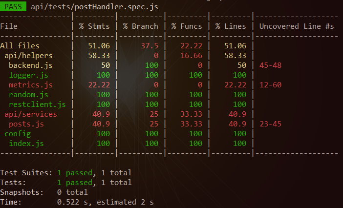
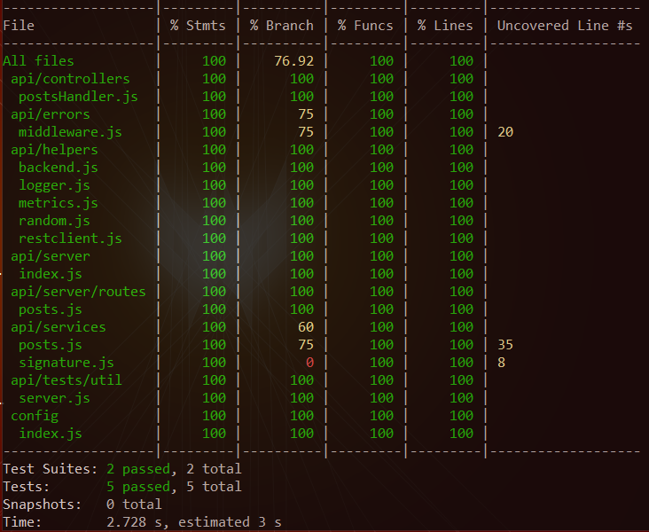
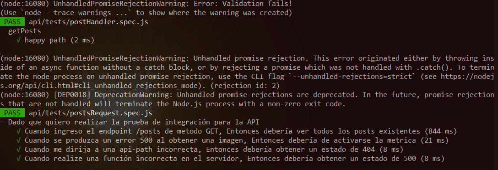
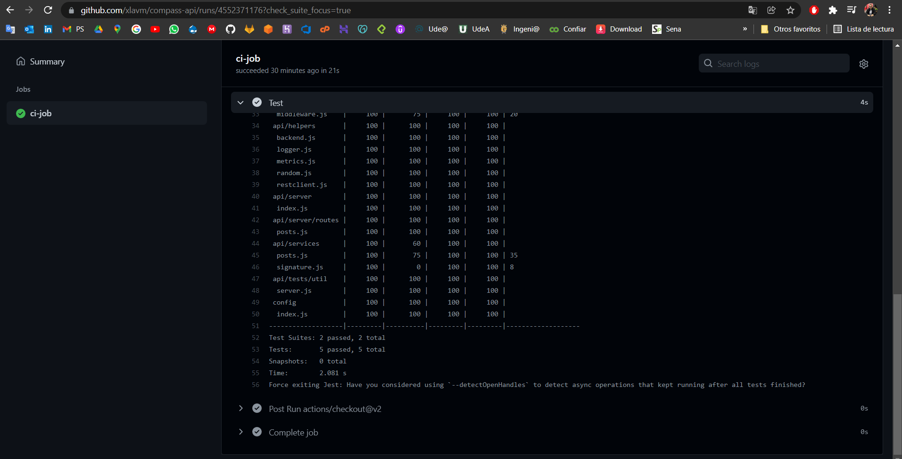

# Challenge Backend


## Resolución de Tests

### **Test Inicial**
* Casos de Pruebas: **1**
* Porcentaje de Cobertura: **51.06%** 



### **Test Final**
* Casos de Pruebas: **5**
* Porcentaje de Cobertura: **100%**



Casos de Pruebas



--------------------------------------------------------------

## Implementación - Test

Realizo un `Exploritory Testing` de la API Back usando la herramienta `Postman` para tener más detalle de los request y response que el servicio genera.

Aplico principios `SOLID` para desarrollar unos scripts escalables y de fácil mantenimiento; (teniendo en cuenta que el desarrollo estaba hecho), aplico `BDD` para realizar los test unitarios y de integración con base a principios de `Clean Code` y aplicando las `Best Practices` recomendadas por los diferentes frameworks utilizados, como: `Jest`, `Supertest`, `Nock`, `Sinon`, `Axios`. Empleando mocks y datos de pruebas que son utilizados y almacenados en la capa `Util` de los test.

Aseguro un `100%` la cobertura de los test, cubriendo así mismo los casos en que la api funciona de forma correcta y de forma incorrecta.

--------------------------------------------------------------

## CI - Test

Creo un archivo `ci.yml` dentro de la ruta: `.github/workflows` que contiene las instrucciones necesarias para llevar a cabo la ejecución de un pipeline de CI que se encarga de ejecutar los `Test` sí se hace un `push` o un `Pull Request` a la rama `Main` (Esto es orquestado por `Github Actions` de forma automatizada).

**Resultado de Ejecución**




--------------------------------------------------------------

## Preparación y Ejecución Local - Test

Sigue las instrucciones que he hecho en `local_config.pdf`

> Ejecuta los comandos: `npm install` y luego `npm run test`

--------------------------------------------------------------

## Requerimientos

Hacer un enpoint (get) que devuelva algunos post (3 o mas). El enpoint debería quedar como `/posts` (get).
El resultado:

```json
{
  "posts": [
    {
      "id": 1,
      "title": "Hola mundo CSS",
      "image": "url de la imagen",
      "tag": "CSS",
      "date": "2021-10-23T18:44:34+0000"
    },
    {
      "id": 2,
      "title": "Hola mundo JS",
      "image": "url de la imagen",
      "tag": "JAVASCRIPT",
      "date": "2021-10-23T18:44:34+0000"
    },
    {
      "id": 3,
      "title": "Hola mundo JAVA",
      "image": "url de la imagen",
      "tag": "JAVA",
      "date": "2021-10-23T18:44:34+0000"
    }
  ]
}
```

## Propuesta

En la propuesta se detallan las carateristicas del endpoint:

- Se separan la logica para responder (controller) de la logica para obtener y procesar los datos.
- Se agregan tipos (usando @ts-check) para mejora la documentacion y el desarrollo
- Se simulan metricas, restclient propio, logger, entre otras cosas
- Controlar los errores 404 y 500
- Entrega en github
- Documentacion en este readme

A continuacion se muestra un grafico que diseñe para bajar los requerimientos "a papel":

> Las cosas que figuran como "opcionales" son ideas para completar la experiencia original.


## Tests

Por cuestiones de tiempo, no pude realizar los test que queria hacer.
Me hubiera justado hacer al menos tests de integracion para:

- el caso feliz
- un error de la api (en la dependencia mockeada)
- una direccion que no ruteamos

## Corriendo la aplicación por primera vez

1. Instalar dependencias:

   ```
   npm install
   ```

2. Correr la aplicación, en otro tab de la terminal:

   ```
   npm run dev
   ```

3. Ejecutar el curl

   ```
   curl http://localhost:3001/api/posts
   ```
